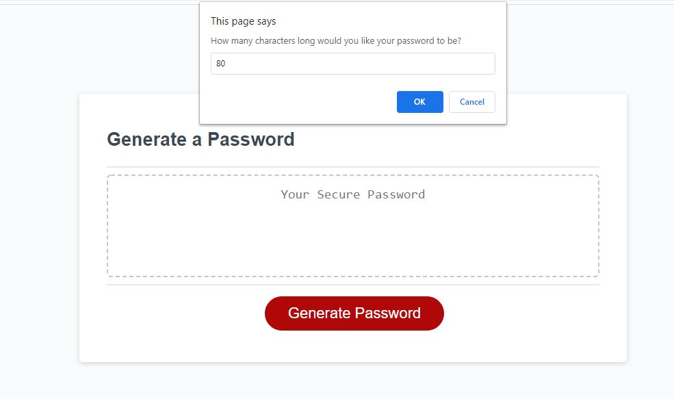

# generate-password

### Go there now: [Generate Password](joe-riley.github.io/generate-password)

## Description
A simple, very unsecure, password generator that shows everything in plain text on your screen that uses browser modals to ask what kind of characters you want in the password.

## User Story
* AS AN employee with access to sensitive data
* I WANT to randomly generate a password that meets certain criteria
* SO THAT I can create a strong password that provides greater security

## Acceptance Criteria
* GIVEN I need a new, secure password
* WHEN I click the button to generate a password
* THEN I am presented with a series of prompts for password criteria
* WHEN prompted for password criteria
* THEN I select which criteria to include in the password
* WHEN prompted for the length of the password
* THEN I choose a length of at least 8 characters and no more than 128 characters
* WHEN prompted for character types to include in the password
* THEN I choose lowercase, uppercase, numeric, and/or special characters
* WHEN I answer each prompt
* THEN my input should be validated and at least one character type should be selected
* WHEN all prompts are answered
* THEN a password is generated that matches the selected criteria
* WHEN the password is generated
* THEN the password is either displayed in an alert or written to the page

-----
## What it Looks Like
